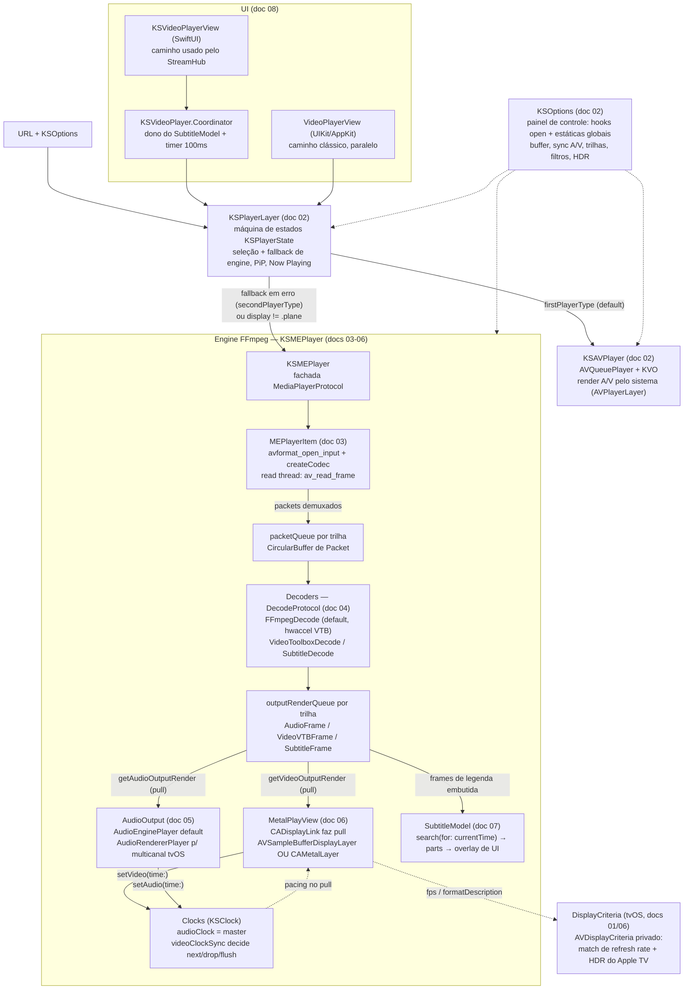

# 00 — Arquitetura

Visão geral de como os subsistemas do fork GPL do KSPlayer se conectam. Este é o documento de entrada: leia-o antes de mexer em qualquer coisa; os detalhes de cada subsistema estão nos docs 01–09 (índice em `docs/README.md`). Todos os paths são relativos à raiz do repo (`/Users/joaoalves/Developer/StreamHub/Player`).

## O que é este repositório

Fork GPL do KSPlayer (upstream `kingslay/KSPlayer`, base `2.3.4-35-g1b8b46f`): player de vídeo Swift para iOS/tvOS/macOS/visionOS com **dois engines de reprodução atrás da mesma interface** (`MediaPlayerProtocol`):

- **`KSAVPlayer`** — wrapper de `AVQueuePlayer`/AVFoundation. Leve, usa o pipeline nativo da Apple (decode, render, áudio, HLS, FairPlay). Limitado aos formatos que o sistema aceita.
- **`KSMEPlayer`** — engine própria sobre FFmpeg 6.1 (binários pré-compilados do pacote `kingslay/FFmpegKit`) + render Metal/`AVSampleBufferDisplayLayer` + saída de áudio própria. Toca "qualquer coisa" (MKV, TrueHD, PGS, VobSub…).

O objetivo do fork é evoluir o `KSMEPlayer` até paridade com a versão paga do KSPlayer e com o Infuse, para consumo pelo app StreamHub (tvOS, caminho SwiftUI).

## Mapa de diretórios

| Diretório | Conteúdo | Doc |
|---|---|---|
| `Package.swift` + `Sources/DisplayCriteria/` | Manifesto SPM, binários FFmpegKit, target ObjC com API privada `AVDisplayCriteria` | 01 |
| `Sources/KSPlayer/AVPlayer/` | Contrato público (`MediaPlayerProtocol`), orquestrador `KSPlayerLayer`, engine `KSAVPlayer`, configuração `KSOptions`, ponte SwiftUI `KSVideoPlayer` | 02 |
| `Sources/KSPlayer/MEPlayer/` | Engine FFmpeg: demux (`MEPlayerItem`), filas, decoders, resample, saídas de áudio, `MetalPlayView` | 03, 04, 05, 06 |
| `Sources/KSPlayer/Metal/` | `MetalRender`, `Shaders.metal`, modelos de projeção (plano/360°) | 06 |
| `Sources/KSPlayer/Subtitle/` | Parsers SRT/VTT/ASS, `SubtitleModel`, fontes online, decode embutido (`SubtitleDecode` fica em MEPlayer/) | 07 |
| `Sources/KSPlayer/Core/`, `Video/`, `SwiftUI/`, `Audio/` | Duas UIs paralelas (UIKit clássica e SwiftUI) + utilitários | 08 |
| `Tests/` | A suíte XCTest | — |

## Os dois engines e quando cada um é usado

Ambos implementam `MediaPlayerProtocol` (`Sources/KSPlayer/AVPlayer/MediaPlayerProtocol.swift:67`) e reportam via `MediaPlayerDelegate`. Quem escolhe é o **`KSPlayerLayer`** (`Sources/KSPlayer/AVPlayer/KSPlayerLayer.swift`):

| Regra | Efeito |
|---|---|
| Default | `KSOptions.firstPlayerType` (= `KSAVPlayer.self`) abre primeiro |
| Erro no primeiro engine | Fallback **silencioso** para `KSOptions.secondPlayerType` (= `KSMEPlayer.self`) com a mesma URL; `state = .error` só se o segundo também falhar (`KSPlayerLayer.swift:444-469`) |
| `options.display != .plane` (360°/VR) | Força `KSMEPlayer` desde o início (`KSPlayerLayer.swift:134-138, 203`) |
| Rota AirPlay ativa | Força `KSAVPlayer` (external playback só existe no engine nativo, `KSPlayerLayer.swift:131-134`) |
| App quer "só FFmpeg" | Setar `KSOptions.firstPlayerType = KSMEPlayer.self` no boot (padrão dos demos UIKit; provável caminho do StreamHub) |

Diferenças práticas: só o `KSMEPlayer` tem legendas embutidas (`subtitleDataSouce`), capítulos, `DynamicInfo` (fps/bitrate/drops), seleção real de trilha de áudio, gravação (remux) e filtros FFmpeg. O `KSAVPlayer` ganha em bateria, DRM e integração com o sistema (AirPlay, HLS nativo).

## Diagrama — URL → demux → decode → render/áudio → UI

O fluxo abaixo é o do `KSMEPlayer` (o engine que importa para o fork). No `KSAVPlayer` tudo dentro do bloco "Engine FFmpeg" é substituído por `AVPlayerItem` + `AVPlayerLayer` do sistema.

### O mesmo fluxo em palavras

1. **UI → orquestrador.** O app entrega `URL` + `KSOptions` ao `KSVideoPlayerView`/`Coordinator` (SwiftUI) ou `VideoPlayerView` (UIKit); ambos criam um `KSPlayerLayer`, que escolhe o engine e mantém a máquina de estados pública (`initialized → preparing → readyToPlay → buffering ⇄ bufferFinished → playedToTheEnd/error`).
2. **Demux.** `MEPlayerItem` abre o container (`avformat_open_input`), mapeia streams para `FFmpegAssetTrack`, elege trilhas (`wantedVideo/wantedAudio` ou `av_find_best_stream`) e sobe a read thread, que empurra `Packet` para a `packetQueue` de cada trilha habilitada. Backpressure em dois estágios: pausa do demux por `maxBufferDuration` e bloqueio das filas cheias.
3. **Decode.** Cada trilha A/V tem thread própria de decode (`AsyncPlayerItemTrack`). `makeDecode` escolhe: legendas → `SubtitleDecode`; vídeo com `asynchronousDecompression && hardwareDecode` → `VideoToolboxDecode`; resto → `FFmpegDecode` (o default real — hwaccel VideoToolbox acontece *dentro* dele via `get_format`). Frames decodificados caem na `outputRenderQueue` (vídeo ordenada por timestamp para B-frames).
4. **Render/áudio (pull).** O `CADisplayLink` do `MetalPlayView` puxa frames; o predicate do pop consulta `KSOptions.videoClockSync` contra o clock mestre e decide renderizar/segurar/dropar — **o pacing A/V acontece no pull, não na apresentação**. O backend de áudio puxa PCM da fila no callback realtime do Core Audio. Cada lado devolve seu tempo (`setVideo`/`setAudio`); o clock mestre é o áudio (vídeo assume se `isAudioStalled`).
5. **Legendas.** Sempre overlay de UI (SwiftUI `VideoSubtitleView` ou labels UIKit) por cima do vídeo — nunca compostas no frame. O `Coordinator` chama `SubtitleModel.subtitle(currentTime:)` a cada 100 ms; a legenda ativa (externa parseada ou trilha embutida) responde com os `SubtitlePart` visíveis.
6. **tvOS.** Mudança de `fps`/`formatDescription` no `MetalPlayView` dispara `KSOptions.updateVideo`, que usa o init privado de `AVDisplayCriteria` para trocar refresh rate/HDR da TV (com downgrade proposital Dolby Vision → HDR10).

## Mapa mental para uma LLM antes de mexer em qualquer coisa

1. **`KSOptions` é o painel de controle de tudo.** Quase toda política (buffering, sync A/V, seleção de trilha, hardware decode, filtros, HDR, ABR, I/O custom) é um método `open` ou uma propriedade de `KSOptions`, consumidos pelo pipeline. O jeito certo de customizar é **subclassear `KSOptions`** (padrão `MEOptions` do demo), não editar o pipeline. Estáticas de `KSOptions`/`SubtitleModel` são **estado global mutável**: configure no boot, antes de criar qualquer player; nada reconfigura instância viva.
2. **Uma interface, dois engines, fallback silencioso.** Erro no primeiro engine não vira `.error` — o `KSPlayerLayer` troca de engine e re-prepara a mesma URL, engolindo o erro original. Ao debugar "por que tocou com o engine errado", comece em `KSPlayerLayer.finish` e no `didSet` de `url`.
3. **O MEPlayer é pull-based na saída e push-based na entrada.** Renderizadores puxam frames; a read thread empurra packets. Pausar o `CADisplayLink` congela o consumo de vídeo; filas cheias seguram o decode; `maxBufferDuration` segura o demux. Não existe "empurrar frame para a tela".
4. **Clock mestre = áudio.** `currentPlaybackTime` deriva de `mainClock().time - startTime`. A decisão frame a frame (render/drop/flush/seek) é de `KSOptions.videoClockSync`. Arquivos em que o áudio acaba antes do vídeo mudam de regime no meio (`isAudioStalled`).
5. **Dois caminhos de render de vídeo, mutuamente exclusivos por frame:** `AVSampleBufferDisplayLayer` (preferido: HDR/DV nativos via attachments, PiP) vs `CAMetalLayer` + shaders (fallback, 10-bit sw, 360°). Decidido em `options.isUseDisplayLayer()` + presença de `CVPixelBuffer`. Trabalho de HDR/tone mapping precisa saber em qual caminho está.
6. **Duas UIs paralelas que não se misturam.** UIKit (`PlayerView`/`VideoPlayerView`) e SwiftUI (`KSVideoPlayerView` + `Coordinator`). Features de UI/legenda precisam ser feitas duas vezes — ou fazer só no SwiftUI, que é o caminho do StreamHub (tvOS).
7. **Threading é manual e delicado.** Main thread: UI, timers, clocks, `prepare` de áudio. OperationQueue serial: open/read/close do item. Uma OperationQueue por trilha: decode. Thread realtime do Core Audio: pull de PCM (proibido bloquear). Thread do VideoToolbox: callbacks fora de ordem. `StrictConcurrency` está ligado no target, mas `MEPlayerItem` é `Sendable` "de fachada" — o compilador **não** protege; siga a disciplina existente. Tipos novos de dados/parsing devem ser `nonisolated`/`Sendable`.
8. **Legendas têm duas naturezas.** Externas: parseadas inteiras para memória (`KSSubtitle.parts`). Embutidas: fila de frames decodificados consumida **destrutivamente** no `search` (o fallback `parts.filter` no `SubtitleModel` é o que mantém a legenda na tela — não remova). Estilo global do `SubtitleModel` sobrescreve fontes ASS a cada tick.
9. **Build vem pronto, não se compila C.** FFmpeg/libass/etc. são binary targets commitados no repo do FFmpegKit (clone multi-GB). libass **é linkado mas não importado** — ASS hoje é parser Swift próprio, aproximado; o produto `libass` precisa ser declarado no manifesto para uso real. Shaders via `Bundle.module` (nome `KSPlayer_KSPlayer` é contrato com CocoaPods).
10. **tvOS tem regras próprias.** `AVDisplayCriteria` é API privada (ok para app pessoal); DV é rebaixado a HDR10 no matching; `CAMetalLayer.edrMetadata` não existe no tvOS; multicanal/Atmos de verdade só com `AudioRendererPlayer`; slider UIKit é fake — scrubbing real é o `TVSlide` do SwiftUI.
11. **Cada doc tem seção "Pegadinhas".** Antes de refatorar qualquer coisa "estranha" (retain cycle intencional no close, `Text("")` obrigatório, ordem de campos no packet de CC, `inout` do `outChannel`…), procure ali — muito código estranho é intencional e está documentado.
12. **Regras do fork:** Swift seguro (sem force-unwrap em código novo — hook do StreamHub bloqueia), sem comentários novos, diffs mínimos, e os testes de playback hoje são no-op (fixtures ausentes) — não confie neles como rede de proteção.

## Por onde começar, por tema

| Quero mexer em… | Comece por | Doc |
|---|---|---|
| Build, FFmpeg, libass, plataformas | `Package.swift`, FFmpegKit | 01 |
| Estados, fallback de engine, PiP, Now Playing, SwiftUI bridge | `KSPlayerLayer`, `KSVideoPlayer` | 02 |
| Abrir/demux/seek/buffer/ABR/gravação | `MEPlayerItem`, `CircularBuffer` | 03 |
| Decoders, hwaccel, HDR side data, pixel/áudio format | `FFmpegDecode`, `Resample.swift`, `AVFFmpegExtension.swift` | 04 |
| Saída de áudio, multicanal/Atmos, volume/rate | `AudioEnginePlayer`, `AudioRendererPlayer`, `AudioDescriptor` | 05 |
| Render, shaders, HDR/EDR, 360°, refresh match tvOS | `MetalPlayView`, `MetalRender`, `KSOptions.updateVideo` | 06 |
| Legendas (parse, fontes online, exibição, embutidas) | `SubtitleModel`, `KSParseProtocol`, `SubtitleDecode` | 07 |
| Controles, foco tvOS, gestos, menus | `KSVideoPlayerView` (SwiftUI) / `VideoPlayerView` (UIKit) | 08 |

Status real das features frente à versão paga/Infuse: tabela em `docs/README.md`; análise individual em `context/investigation/`.
