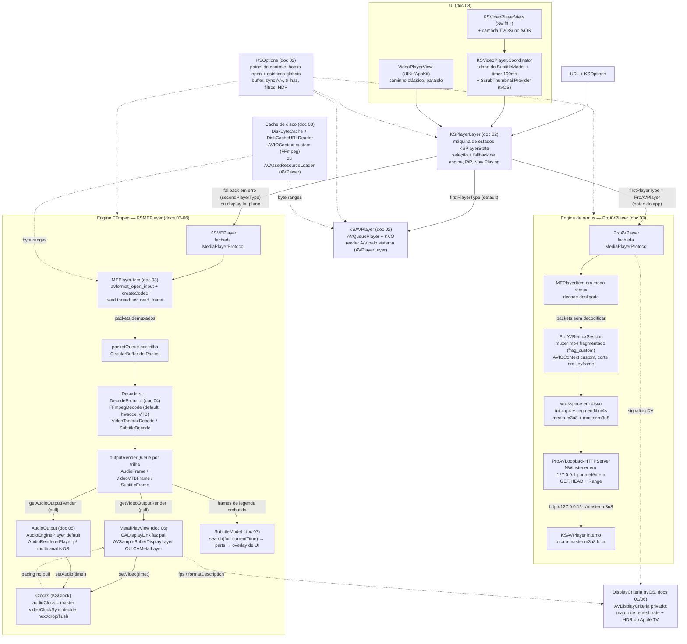

# 00 — Arquitetura

Visão geral de como os subsistemas do Lumen se conectam. Este é o documento de entrada: leia-o antes de mexer em qualquer coisa; os detalhes de cada subsistema estão nos docs 01–08 (índice em `docs/README.md`). Todos os paths são relativos à raiz do repo.

## O que é este repositório

Lumen é um fork GPL do KSPlayer (upstream `kingslay/KSPlayer`): player de vídeo Swift para iOS/tvOS/macOS/macCatalyst com **três engines de reprodução atrás da mesma interface** (`MediaPlayerProtocol`):

- **`KSAVPlayer`** — wrapper de `AVQueuePlayer`/AVFoundation. Leve, usa o pipeline nativo da Apple (decode, render, áudio, HLS, FairPlay). Limitado aos formatos que o sistema aceita.
- **`KSMEPlayer`** — engine própria sobre FFmpeg 8.1 (binários pré-compilados vendorizados em `FFmpegKit/`) + render Metal/`AVSampleBufferDisplayLayer` + saída de áudio própria. Toca "qualquer coisa" (MKV, TrueHD, PGS, VobSub…).
- **`ProAVPlayer`** — engine híbrida: **remuxa** o container de entrada (tipicamente MKV) para **HLS fMP4** em disco, serve os segmentos por um **servidor HTTP local em loopback** e delega a reprodução a um `KSAVPlayer` interno. O objetivo é obter **Dolby Vision e Dolby Atmos nativos** — o decode e o render são inteiramente da Apple, o FFmpeg só reempacota o bitstream sem reencodar o vídeo.

O foco do fork é a experiência tvOS pelo caminho SwiftUI, com uma interface de player dedicada em `Sources/Lumen/SwiftUI/TVOS/`.

## Mapa de diretórios

| Diretório | Conteúdo | Doc |
|---|---|---|
| `Package.swift` + `Sources/DisplayCriteria/` | Manifesto SPM, binários FFmpegKit, target ObjC com API privada `AVDisplayCriteria` | 01 |
| `Sources/Lumen/AVPlayer/` | Contrato público (`MediaPlayerProtocol`), orquestrador `KSPlayerLayer`, engine `KSAVPlayer`, configuração `KSOptions`, ponte SwiftUI `KSVideoPlayer` | 02 |
| `Sources/Lumen/MEPlayer/` | Engine FFmpeg: demux (`MEPlayerItem`), filas, decoders, resample, saídas de áudio, `MetalPlayView`; também o engine `ProAVPlayer` (`ProAV*.swift`) e o `ScrubThumbnailEngine` | 03, 04, 05, 06 |
| `Sources/Lumen/Cache/` | Cache de disco por byte-range (`DiskByteCache`, `DiskCacheURLReader`) para streams HTTP remotos | 03 |
| `Sources/Lumen/Metal/` | `MetalRender`, `Shaders.metal`, modelos de projeção (plano/360°) | 06 |
| `Sources/Lumen/Subtitle/` | Parsers SRT/VTT/ASS, `SubtitleModel`, fontes online, `EmbeddedFontRegistry` (fontes embutidas em MKV); decode embutido (`SubtitleDecode`) fica em MEPlayer/ | 07 |
| `Sources/Lumen/Core/`, `Video/`, `SwiftUI/`, `Audio/` | Duas UIs paralelas (UIKit clássica e SwiftUI) + utilitários | 08 |
| `Sources/Lumen/SwiftUI/TVOS/` | A interface tvOS completa: transport bar, scrubber, thumbnails de scrubbing, painéis de info/elenco/avançado, popover de trilhas | 08 |
| `Tests/` | A suíte XCTest (`Tests/LumenTests/`) | — |

## Os três engines e quando cada um é usado

Os três implementam `MediaPlayerProtocol` (`Sources/Lumen/AVPlayer/MediaPlayerProtocol.swift`) e reportam via `MediaPlayerDelegate`. Quem escolhe é o **`KSPlayerLayer`** (`Sources/Lumen/AVPlayer/KSPlayerLayer.swift`):

| Regra | Efeito |
|---|---|
| Default | `KSOptions.firstPlayerType` (= `KSAVPlayer.self`) abre primeiro |
| Erro no primeiro engine | Fallback **silencioso** para `KSOptions.secondPlayerType` (= `KSMEPlayer.self`) com a mesma URL; `state = .error` só se o segundo também falhar |
| `options.display != .plane` (360°/VR) | Força `KSMEPlayer` desde o início |
| Rota AirPlay ativa | Força `KSAVPlayer` (external playback só existe no engine nativo) |
| App quer "só FFmpeg" | Setar `KSOptions.firstPlayerType = KSMEPlayer.self` no boot |
| App quer DV/Atmos nativos | Setar `KSOptions.firstPlayerType = ProAVPlayer.self` e manter `secondPlayerType = KSMEPlayer.self` como rede |

**Importante**: não existe seleção automática do `ProAVPlayer` — o `KSPlayerLayer` só conhece as regras acima e a estática `KSOptions.firstPlayerType`. Usar ProAV é sempre um **opt-in explícito do app consumidor**. O que existe é uma recusa automática: se a mídia não for compatível (ver doc 03), o `ProAVPlayer` falha na abertura e o fallback normal leva ao `KSMEPlayer`.

Diferenças práticas: só o `KSMEPlayer` tem legendas embutidas (`subtitleDataSouce`), capítulos, `DynamicInfo` (fps/bitrate/drops), seleção real de trilha de áudio, gravação (remux) e filtros FFmpeg. O `KSAVPlayer` ganha em bateria, DRM e integração com o sistema (AirPlay, HLS nativo). O `ProAVPlayer` entrega DV/Atmos nativos ao custo de não ter seek barato (todo seek re-remuxa a partir do novo ponto) nem legendas embutidas.

## Diagrama — URL → demux → decode → render/áudio → UI

O fluxo abaixo é o do `KSMEPlayer` (o engine que importa para o fork). No `KSAVPlayer` tudo dentro do bloco "Engine FFmpeg" é substituído por `AVPlayerItem` + `AVPlayerLayer` do sistema.

### O mesmo fluxo em palavras

1. **UI → orquestrador.** O app entrega `URL` + `KSOptions` ao `KSVideoPlayerView`/`Coordinator` (SwiftUI) ou `VideoPlayerView` (UIKit); ambos criam um `KSPlayerLayer`, que escolhe o engine e mantém a máquina de estados pública (`initialized → preparing → readyToPlay → buffering ⇄ bufferFinished → playedToTheEnd/error`).
2. **Demux.** `MEPlayerItem` abre o container (`avformat_open_input`), mapeia streams para `FFmpegAssetTrack`, elege trilhas (`wantedVideo/wantedAudio` ou `av_find_best_stream`) e sobe a read thread, que empurra `Packet` para a `packetQueue` de cada trilha habilitada. Backpressure em dois estágios: pausa do demux por `maxBufferDuration` e bloqueio das filas cheias.
3. **Decode.** Cada trilha A/V tem thread própria de decode (`AsyncPlayerItemTrack`). `makeDecode` escolhe: legendas → `SubtitleDecode`; vídeo com `asynchronousDecompression && hardwareDecode` → `VideoToolboxDecode`; resto → `FFmpegDecode` (o default real — hwaccel VideoToolbox acontece *dentro* dele via `get_format`). Frames decodificados caem na `outputRenderQueue` (vídeo ordenada por timestamp para B-frames).
4. **Render/áudio (pull).** O `CADisplayLink` do `MetalPlayView` puxa frames; o predicate do pop consulta `KSOptions.videoClockSync` contra o clock mestre e decide renderizar/segurar/dropar — **o pacing A/V acontece no pull, não na apresentação**. O backend de áudio puxa PCM da fila no callback realtime do Core Audio. Cada lado devolve seu tempo (`setVideo`/`setAudio`); o clock mestre é o áudio (vídeo assume se `isAudioStalled`).
5. **Legendas.** Sempre overlay de UI (SwiftUI `VideoSubtitleView` ou labels UIKit) por cima do vídeo — nunca compostas no frame. O `Coordinator` chama `SubtitleModel.subtitle(currentTime:)` a cada 100 ms; a legenda ativa (externa parseada ou trilha embutida) responde com os `SubtitlePart` visíveis.
6. **tvOS.** Mudança de `fps`/`formatDescription` no `MetalPlayView` dispara `KSOptions.updateVideo`, que usa o init privado de `AVDisplayCriteria` para trocar refresh rate/HDR da TV (com downgrade proposital Dolby Vision → HDR10). No `ProAVPlayer` o mesmo critério é aplicado a partir do signaling derivado do container, sem downgrade.
7. **Caminho ProAV (quando ativado).** O `MEPlayerItem` é aberto em modo remux (decode desligado): os packets vão direto para um muxer `mp4` fragmentado cujo `AVIOContext` é custom, e o Swift decide em qual arquivo cada byte cai, cortando segmentos em keyframe. Assim que há segmentos suficientes, um servidor HTTP em loopback sobe e um `KSAVPlayer` interno recebe a URL do `master.m3u8` local.
8. **Cache de disco (opcional).** Se o app definir um diretório de cache, os dois lados passam a ler por byte-range de um `DiskByteCache` compartilhado: o FFmpeg via `AVIOContext` customizado, o AVFoundation via `AVAssetResourceLoaderDelegate`.

## Mapa mental para uma LLM antes de mexer em qualquer coisa

1. **`KSOptions` é o painel de controle de tudo.** Quase toda política (buffering, sync A/V, seleção de trilha, hardware decode, filtros, HDR, ABR, I/O custom) é um método `open` ou uma propriedade de `KSOptions`, consumidos pelo pipeline. O jeito certo de customizar é **subclassear `KSOptions`** (padrão `MEOptions` do demo), não editar o pipeline. Estáticas de `KSOptions`/`SubtitleModel` são **estado global mutável**: configure no boot, antes de criar qualquer player; nada reconfigura instância viva.
2. **Uma interface, três engines, fallback silencioso.** Erro no primeiro engine não vira `.error` — o `KSPlayerLayer` troca de engine e re-prepara a mesma URL, engolindo o erro original. Ao debugar "por que tocou com o engine errado", comece em `KSPlayerLayer.finish` e no `didSet` de `url`. O `ProAVPlayer` depende inteiramente desse mecanismo: ele **recusa** mídia incompatível falhando na abertura, e é o fallback que salva a reprodução.
3. **O MEPlayer é pull-based na saída e push-based na entrada.** Renderizadores puxam frames; a read thread empurra packets. Pausar o `CADisplayLink` congela o consumo de vídeo; filas cheias seguram o decode; `maxBufferDuration` segura o demux. Não existe "empurrar frame para a tela".
4. **Clock mestre = áudio.** `currentPlaybackTime` deriva de `mainClock.time - startTime`. A decisão frame a frame (render/drop/flush/seek) é de `KSOptions.videoClockSync`. Arquivos em que o áudio acaba antes do vídeo mudam de regime no meio (`isAudioStalled`).
5. **Dois caminhos de render de vídeo, mutuamente exclusivos por frame:** `AVSampleBufferDisplayLayer` (preferido: HDR/DV nativos via attachments, PiP) vs `CAMetalLayer` + shaders (fallback, 10-bit sw, 360°). Decidido em `options.isUseDisplayLayer` + presença de `CVPixelBuffer`. Trabalho de HDR/tone mapping precisa saber em qual caminho está.
6. **Duas UIs paralelas que não se misturam.** UIKit (`PlayerView`/`VideoPlayerView`) e SwiftUI (`KSVideoPlayerView` + `Coordinator`). Features de UI/legenda precisam ser feitas duas vezes — ou fazer só no SwiftUI, que é o caminho mantido no tvOS. No tvOS há ainda uma terceira camada, `Sources/Lumen/SwiftUI/TVOS/`, que substitui a barra de controles genérica por transport bar, scrubber e painéis próprios.
7. **Threading é manual e delicado.** Main thread: UI, timers, clocks, `prepare` de áudio. OperationQueue serial: open/read/close do item. Uma OperationQueue por trilha: decode. Thread realtime do Core Audio: pull de PCM (proibido bloquear). Thread do VideoToolbox: callbacks fora de ordem. `StrictConcurrency` está ligado no target, mas `MEPlayerItem` é `Sendable` "de fachada" — o compilador **não** protege; siga a disciplina existente. Tipos novos de dados/parsing devem ser `nonisolated`/`Sendable`.
8. **Legendas têm duas naturezas.** Externas: parseadas inteiras para memória (`KSSubtitle.parts`). Embutidas: fila de frames decodificados consumida **destrutivamente** no `search` (o fallback `parts.filter` no `SubtitleModel` é o que mantém a legenda na tela — não remova). Estilo global do `SubtitleModel` sobrescreve fontes ASS a cada tick, exceto quando o nome resolve para uma fonte embutida registrada pelo `EmbeddedFontRegistry`.
9. **Build vem pronto, não se compila C.** FFmpeg 8.1 e amigos são binary targets baixados por `url:`+`checksum:` a partir do manifesto vendorizado em `FFmpegKit/`. libass **é linkado mas não importado** — ASS hoje é parser Swift próprio, aproximado; o produto `libass` precisa ser declarado no manifesto para uso real. Shaders via `Bundle.module`.
10. **tvOS tem regras próprias.** `AVDisplayCriteria` é API privada; no caminho MEPlayer o DV é rebaixado a HDR10 no matching; `CAMetalLayer.edrMetadata` não existe no tvOS; multicanal/Atmos de verdade só com `AudioRendererPlayer` (ou com o `ProAVPlayer`, que devolve o bitstream EC-3 ao AVFoundation); o slider UIKit é fake e o `TVSlide` legado foi substituído, no player SwiftUI, pelo `TVScrubberInput` + `TVTransportBar`.
11. **Cada doc tem seção "Pegadinhas".** Antes de refatorar qualquer coisa "estranha" (retain cycle intencional no close, `Text("")` obrigatório, ordem de campos no packet de CC, `inout` do `outChannel`…), procure ali — muito código estranho é intencional e está documentado.
12. **Regras do fork:** Swift seguro (sem force-unwrap em código novo), sem comentários novos, diffs mínimos, e os testes de playback hoje são no-op (fixtures ausentes) — não confie neles como rede de proteção.

## Por onde começar, por tema

| Quero mexer em… | Comece por | Doc |
|---|---|---|
| Build, FFmpeg, libass, plataformas | `Package.swift`, FFmpegKit | 01 |
| Estados, fallback de engine, PiP, Now Playing, SwiftUI bridge | `KSPlayerLayer`, `KSVideoPlayer` | 02 |
| Abrir/demux/seek/buffer/ABR/gravação | `MEPlayerItem`, `CircularBuffer` | 03 |
| Decoders, hwaccel, HDR side data, pixel/áudio format | `FFmpegDecode`, `Resample.swift`, `AVFFmpegExtension.swift` | 04 |
| Saída de áudio, multicanal/Atmos, volume/rate | `AudioEnginePlayer`, `AudioRendererPlayer`, `AudioDescriptor` | 05 |
| Render, shaders, HDR/EDR, 360°, refresh match tvOS | `MetalPlayView`, `MetalRender`, `KSOptions.updateVideo` | 06 |
| Legendas (parse, fontes online, exibição, embutidas, fontes de MKV) | `SubtitleModel`, `KSParseProtocol`, `SubtitleDecode`, `EmbeddedFontRegistry` | 07 |
| Controles, foco tvOS, gestos, menus | `KSVideoPlayerView` (SwiftUI) / `VideoPlayerView` (UIKit) | 08 |
| Interface tvOS (transport bar, scrubber, painéis, thumbnails) | `Sources/Lumen/SwiftUI/TVOS/` | 08 |
| Dolby Vision/Atmos nativos, remux para HLS | `ProAVPlayer`, `ProAVRemuxSession`, `ProAVPlaylist` | 03 |
| Cache de disco de streams remotos | `DiskByteCache`, `DiskCacheURLReader`, `DiskCacheAVIOContext` | 03 |

Panorama de capacidades por subsistema: tabela em `docs/README.md`.
